# Proyecto - Tipos Abstractos de Datos

## Descripción del Problema

**Este ejercicio implementa el TAD Rational**

## Ejecución Rational

Tu programa debería ejecutarse de la siguiente manera:

```
======================
*.     Rational.     *
======================
Introduce el numerador   del Racional a: 7
Introduce el denominador del Racional a: 5
Introduce el numerador   del Racional b: 2
Introduce el denominador del Racional b: 3

Racional a = 7/5
Racional b = 2/3

7/5 + 2/3 =31/15
7/5 * 2/3 =14/15
2/5 = 4/10 = True

```


## Diagrama de clases
[Editor en línea](https://mermaid.live/)
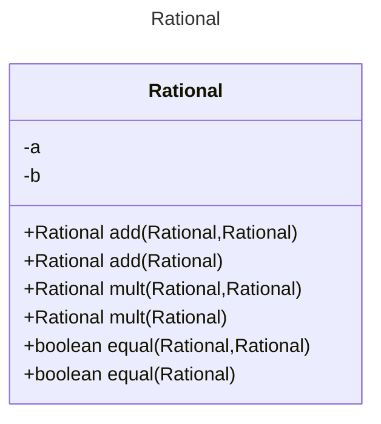
[Referencia-Mermaid](https://mermaid.js.org/syntax/classDiagram.html)
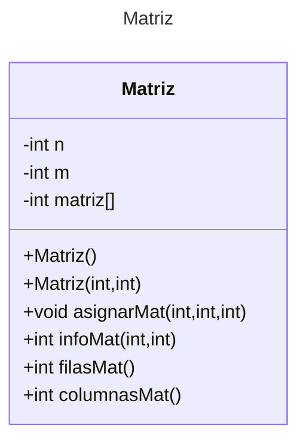
[Referencia-Mermaid](https://mermaid.js.org/syntax/classDiagram.html)
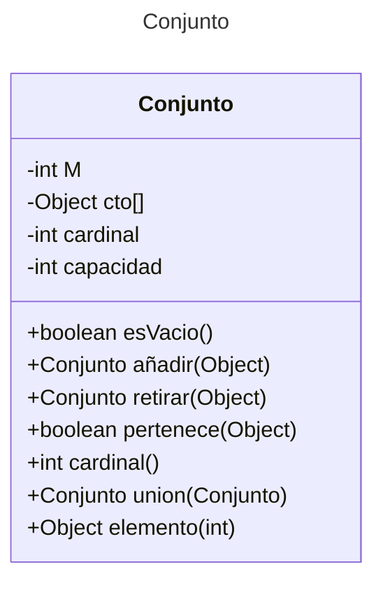

```
======================
*.       Persona       *
======================
Capturar los Datos de al menos una persona.

Nombre = Lourdes Armenta
DNI = AELL680211
Fecha (DD/MM/AAAA)= 11/2/1968


```

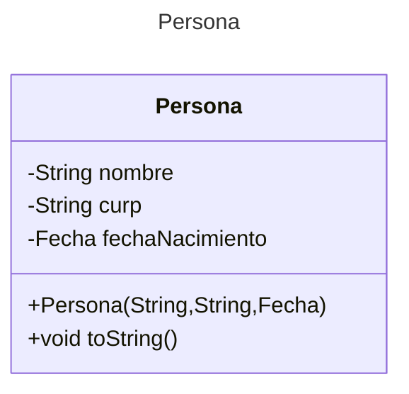
```
======================
*.       Fecha       *
======================

Proporciona dia en formato DD de Fecha 1= 2
Proporciona mes en formato MM de Fecha 1= 11
Proporciona Anio  en formato de Fecha 1AAAA= 1970
Proporciona Fecha 2 en formato (DD/MM/AAAA): 2/11/1970
La Fecha1 es igual a la Fecha 2
Agrega a la Fecha 1: un año(360 dias), un mes(30 dias) y un día
La Fecha resultanes es: 3/12/1971
Calcula el número de Días que tiene la Fecha: 2/11/1970"
Numero de días de la Fecha 2/11/1970 = 709532


```
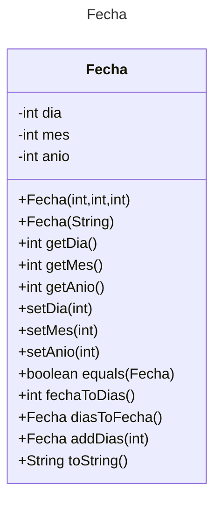

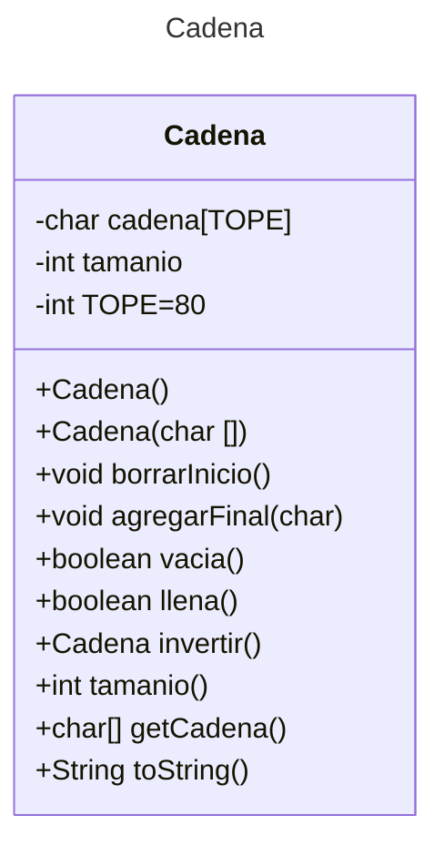
## Ejecución Numerote

Tu programa debería ejecutarse de la siguiente manera:

```
======================
*.     Numerote.     *
======================
Introduce un numerote a: 987654321543216789123
Introduce un numerote b: 123456789123456789123


suma     a+b = 1111111110666673578246
resta    a-b = 864197532419760000000

987654321543216789123 + 123456789123456789123 = 1111111110666673578246
                                                
987654321543216789123 - 123456789123456789123 = 864197532419760000000
                                                                                    


```
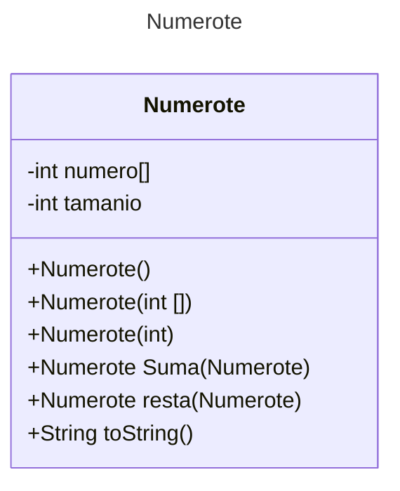
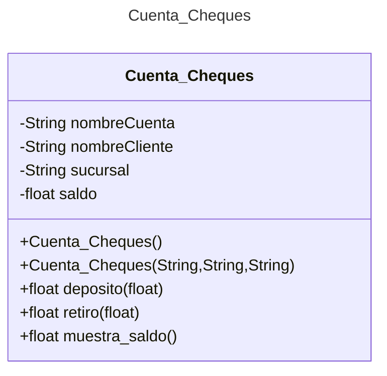

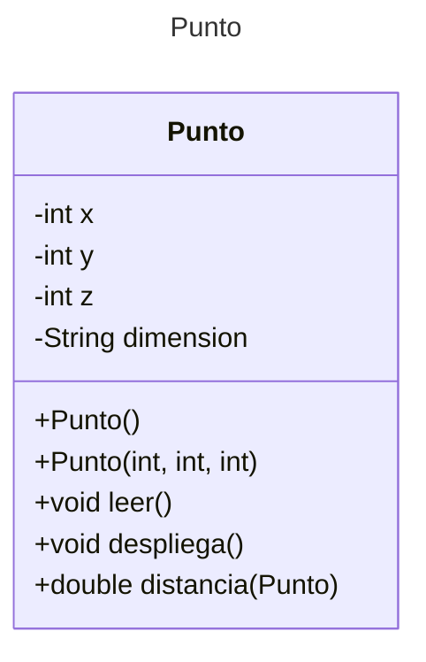

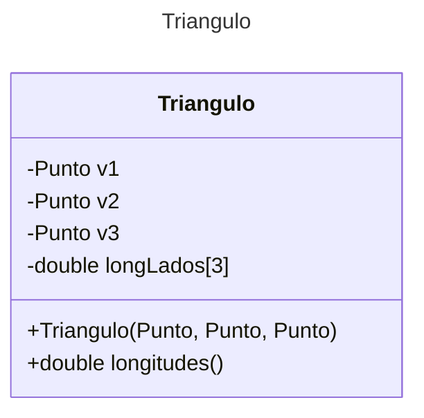
```
======================
*.     Poligono.     *
======================
Dame Lados del Polígono: 5
Introduce un numerote b: 123456789123456789123
Dame coordenada(x) de vertice 1: 1
Dame coordenada(Y) de vertice 1: 1
Dame coordenada(x) de vertice 2: 1
Dame coordenada(Y) de vertice 2: 4
Dame coordenada(x) de vertice 3: 3
Dame coordenada(Y) de vertice 3: 4
Dame coordenada(x) de vertice 4: 4
Dame coordenada(Y) de vertice 4: 3
Dame coordenada(x) de vertice 5: 3
Dame coordenada(Y) de vertice 5: 1

Vertice1 x =1    y =1
Vertice2 x =1    y =4
Vertice3 x =3    y =4
Vertice4 x =4    y =3
Vertice5 x =3    y =1
Perimetro = 10.650281539872886

```
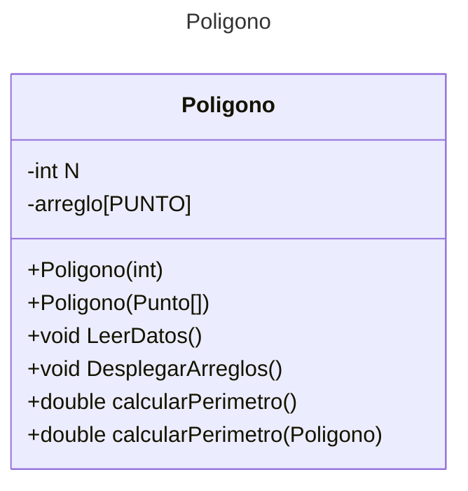

[Referencia-Mermaid](https://mermaid.js.org/syntax/classDiagram.html)

## Diagrama de clases UML con draw.io
El repositorio está configurado para crear Diagramas de clases UML con ```draw.io```. Para usarlo simplemente agrega un archivo con extensión ```.drawio.png```, das doble clic sobre el mismo y se activará el editor ```draw.io``` incrustado en ```VSCode``` para edición. Asegúrate de agregar las formas UML en el menú de formas del lado izquierdo (opción ```+Más formas```).
## Uso del proyecto con make

### Default - Compilar+Probar+Ejecutar
```
make
```
### Compilar
```
make compile
```
### Probar todo
```
make test
```
### Ejecutar App
```
make run
```
### Limpiar binarios
```
make clean
```
## Comandos Git-Cambios y envío a Autograding

### Por cada cambio importante que haga, actualice su historia usando los comandos:
```
git add .
git commit -m "Descripción del cambio"
```
### Envíe sus actualizaciones a GitHub para Autograding con el comando:
```
git push origin main
```
## Comandos individuales
### Compilar

```
find ./ -type f -name "*.java" > compfiles.txt
javac -d build -cp lib/junit-platform-console-standalone-1.5.2.jar @compfiles.txt
```
### Ejecutar ambos comandos en 1 sólo paso:
```
find ./ -type f -name "*.java" > compfiles.txt ; javac -d build -cp lib/junit-platform-console-standalone-1.5.2.jar @compfiles.txt
```

### Ejecutar Todas la pruebas locales de 1 Test Case
```
java -jar lib/junit-platform-console-standalone-1.5.2.jar -class-path build --select-class miTest.AppTest
```
### Ejecutar 1 prueba local de 1 Test Case
```
java -jar lib/junit-platform-console-standalone-1.5.2.jar -class-path build --select-method miTest.AppTest#appHasAGreeting
```
### Ejecutar App
```
java -cp build miPrincipal.Principal
```
Los comandos anteriores están considerados para un ambiente Linux. [Referencia.](https://www.baeldung.com/junit-run-from-command-line)
